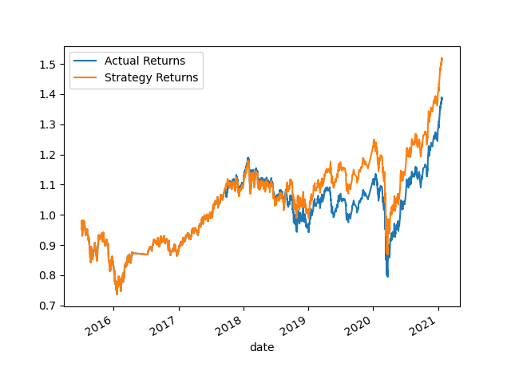
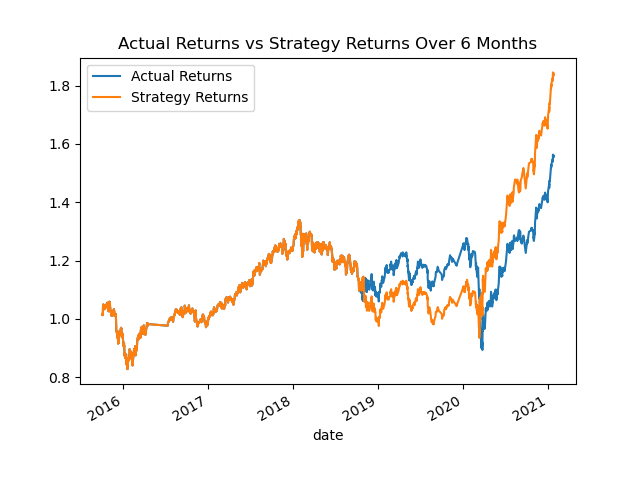
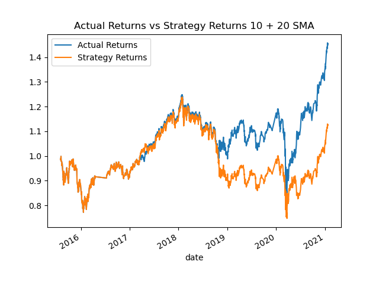
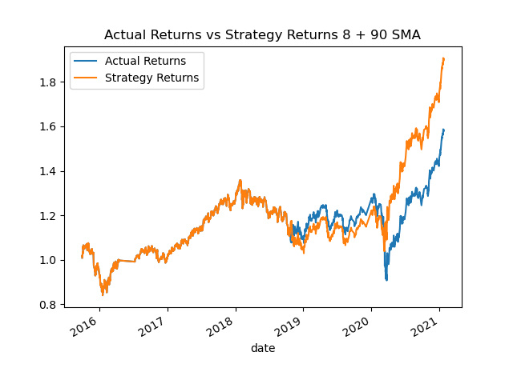
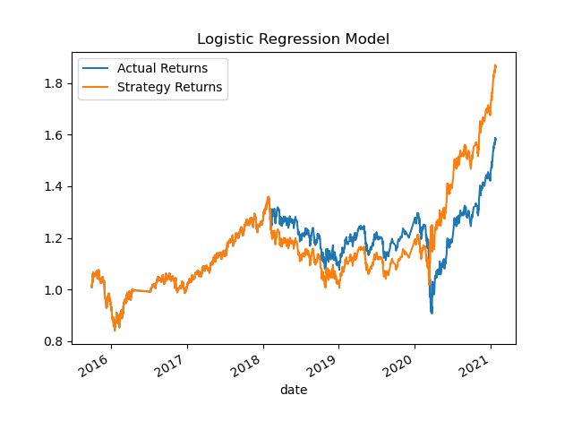

# Module 14 - Algo Trading Challenge
## Conclusions

The baseline trading algorithm traded in parralel with the actual returns for the first 3 years, however in 2019 it started to outperform, seeing higher returns.

After increasing the training window to 6 months (up from 3 months), the strategy returns were increased in comparison to the previous model, reaching a peak of 1.8 in 2021, compared to 1.5 for the shorter training window. 

Next, I changed the short SMA to 10, and the long to 20. The results were negatively impacted, as seen in the plot the strategy underperformed the actual returns. Best to change these back.

Finally, after trying a few different combinations of SMA windows, I thought a short window of 8 and long window of 90 looked best on the plot.

In addition, I tried using the Logistic Regression classifier to create a new model. The baseline model performed better up until the market crash in 2020, holding its value better until then. However the LR model didn't decrease as much in the crash, and recovered much stronger in the following year.
The LR model performed similar to my tuned model - however my tuned model didn't drop as much value in the 2018 period.
